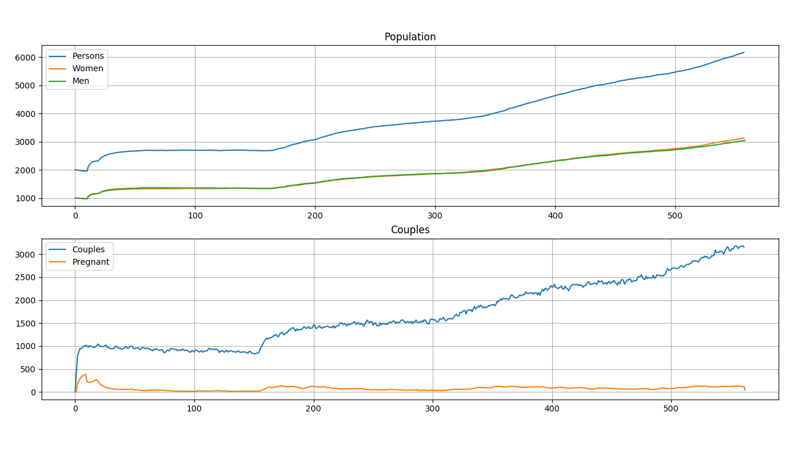
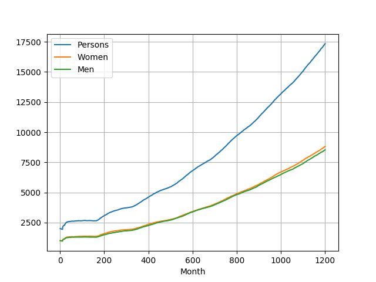
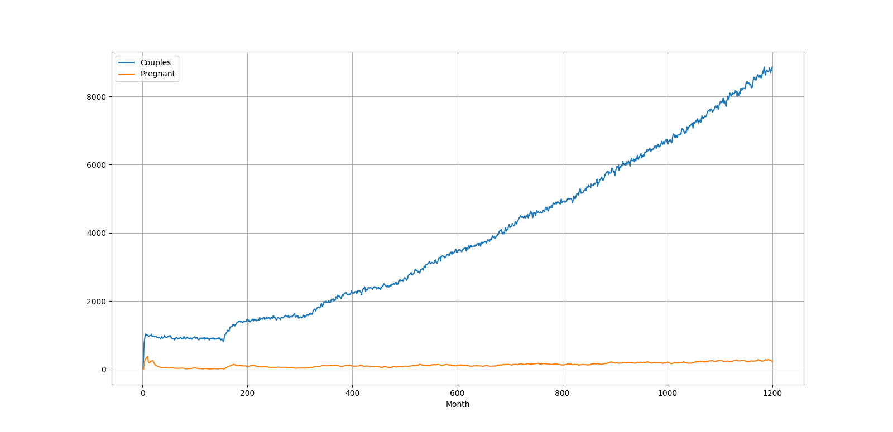

# Informe

Como el objetivo de la simulación es ver el transcurso del tiempo de una población, el primer elemento definido es la 
unidad de medida del tiempo. Los eventos son simulados con un intervalo de tiempo de **1 mes**.

Se tomaron los meses como unnidad atómica puesto que todas las probabilidad dadas dependen como mínimo de la edad en 
años, además la unidad de tiempo de los embarzos es en meses, 9 en este caso. Para el resto de eventos no influye en que 
momento del més es que sucede.

El tiempo recomendado para la simulación es de 100 años ya que es un período de tiempo donde se manifiestan la mayoría 
de los eventos.

Antes de comenzar la simulación de los meses se genera la población inicial, donde las edades es una variable aleatoria 
que distribuye uniforme en el intervalo [1,100]. Un aspecto a destacar es que no van a existir parejas al inicio.

A continuación se describe todo el proceso de simulación en un mes por cada persona de la población:

1. **Comprobar si la persona muere en este mes.** En este aspecto los datos usados no concuerdan con los de la 
orientación debido a que se usaron otros más cercanos a la realidad. Los datos fueron extraidos de 
[Estadísticas de Mortalidad del Reino Unido en el año 2005](http://www.statistics.gov.uk/booth/Risk/dyingage.html). 
Quedando entonces las siguientes probabilidades para cada mes:

    |     Edad         | Hombre  |  Mujer   |
    |      ---         |   ---   |   ---    |
    | Menor de 1 año   | 1/2124  | 1/2724   |
    | 1-4              | 1/52632 | 1/64512  |
    | 5-14             | 1/99996 | 1/125004 |
    | 15-24            | 1/22896 | 1/49584  |
    | 25-34            | 1/14580 | 1/29856  |
    | 35-44            | 1/7956  | 1/13272  |
    | 45-54            | 1/3348  | 1/5052   |
    | 55-64            | 1/1344  | 1/2136   |
    | 65-74            | 1/504   | 1/780    |
    | 75-84            | 1/180   | 1/252    |
    | Mayor de 85 años | 1/72    | 1/84     |

    Cuando una persona fallece se comprueba si tenía pareja, en caso que se cumpla la otra persona de la pareja pasa a
    estar soltera. Se genera entonces un período de tiempo durante el cual esa persona no quiere tener pareja, se puede 
    ver como un período de luto.

2. Si la persona no fallece y es mujer, se comprueba si está embarazada. Si esto sucede entonces se comprueba el tiempo
de embarazo restante. Si da a luz en el mes actual se agregan los hijos a la población con una probabilidad del 50% de 
ser hombre o mujer. 
 
3. Se **comprueba si la persona tiene pareja o no**, para lo cual se realiza lo siguiente:
    * Si **no tiene pareja** se trata de buscar una pareja con otra persona del sexo opuesto que también desee tener 
    pareja en ese mes. La probabilidad de querer pareja es la siguiente:
    
    | Edad      | Probabilidad de querer pareja |
    | ---       | ---                           |
    | 0-11      | 0                             |
    | 12-14     | 0.6                           |
    | 15-20     | 0.65                          |
    | 21-34     | 0.8                           |
    | 35-44     | 0.6                           |
    | 45-59     | 0.5                           |
    | 60-124    | 0.2                           |
    | 125 o más | 0                             |
    * Si **tiene pareja** se comprueba si la pareja rompe en ese mes, para esto se utiliza una variable aleatoria 
    uniforme de [0,1], si es menor que 0.2 la pareja rompe. Si la pareja no rompe se va a intentar tener un hijo. 
    Para que quede embarazada debe pasar que: la mujer no puede estar embarazada, tanto la mujer como el hombre deben 
    desear tener un hijo (teniendo en cuenta la cantidad de hijos que ya tienen) y además influye la probabilidad de 
    embarazo. Para cada una de estas condiciones se establecieron la siguientes probabilidades:

    | Cantidad de hijos | Probabilidad de querer otro hijo |
    | ---               | ---                              |
    | 0                 | 0.9901                           |
    | 1                 | 0.4401                           |
    | 2                 | 0.0401                           |
    | 3                 | 0.0011                           |
    | 4 o más           | 0.0001                           |
     
    | Edad      | Probabilidad que quedar embarazada |
    | ---       | ---                                |
    | 0-11      | 0                                  |
    | 12-15     | 0.2                                |
    | 15-20     | 0.85                               |
    | 21-25     | 0.9                                |
    | 26-30     | 0.8                                |
    | 31-35     | 0.75                               |
    | 36-40     | 0.55                               |
    | 41-45     | 0.38                               |
    | 46-60     | 0.05                               |
    | Más de 60 | 0                                  |


> Las probabilidades que no se encuentren aquí es debido a que se mantuvieron igual que en la orientación del proyecto.

## Ejemplo

A continuación un ejemplo de simulación con una población inicial de 1000 mujeres y 1000 hombres durante 100 años.

Se ejecuta el siguiente comando:

```
python3 main.py 1200 1000 1000
```

Durante la ejecución se muestran gráficos en tiempo real para poder observar la evolución, y así no esperar hasta el 
final de la simulación para poder interpretar los datos. La siguiente imagen es un ejemlpo de los gráficos en tiempo
real:



Al finalizar la simulación se muestran dos gráficas, la primera de la evolución de la población y la segunda de la 
cantidad de parejas y embarazos.



